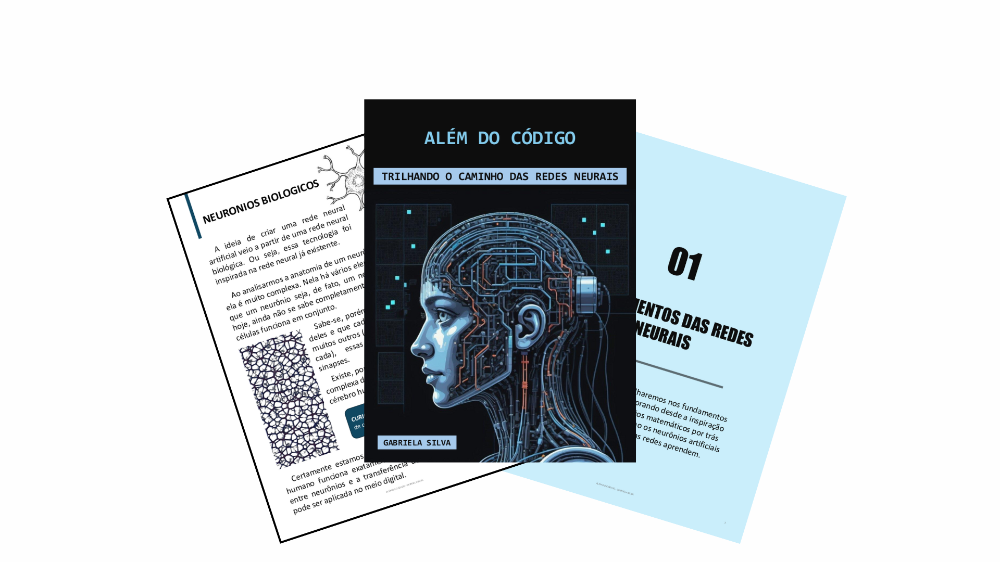

# receita-para-criar-um-ebook
Como criar um Ebook usando IA

# Projeto EBOOK Gerado por I.A.s

 > ℹ️ **NOTE:** Este é um repositório desenvolvido durante o curso no qual fui aluna do Bootcamp Santander 2024 na plataforma da [DIO](https://dio.me) com o auxilio do professor [Felipe Aguiar](https://github.com/felipeAguiarCode), inspirada em seu projeto [prompts-recipe-to-create-a-ebook](https://github.com/felipeAguiarCode/prompts-recipe-to-create-a-ebook/tree/main).

Projeto com o objetivo de gerar um Ebook Digital com as facilidades das ferramentas de IA. Todos os prompts
seguem abaixo.

<a href="Ebook Redes Neuraus Artificiais.pdf" title="View PDF now"> 📕Clique aqui para ler o Ebook</a>

## 💻 Tecnologias utilizadas no projeto

- [ChatGPT](https://chat.openai.com/) 
- [MidJourney](https://www.midjourney.com/app/)
- [DALL-E 3](https://openart.ai/home)
- [PowerPoint](https://www.microsoft.com/en/microsoft-365/powerpoint)

## 🧠 Prompts

ChatGPT：

|   Ação   | prompt                                                                                                                                                                                                                                                                         |
| :------: | ------------------------------------------------------------------------------------------------------------------------------------------------------------------------------------------------------------------------------------------------------------------------------ |
|  título  | Crie um título de um ebook sobre o tema de Redes Neurias, o ebook é do nicho de programação e o subnicho é de inteligencia artificial, o título deve ser épico e curto, me liste 5 variações de títulos                                                        |
| conteúdo | Crie um Ebook, sobre o tema redes neurais artificiais,o ebook é do nicho de programação , e o subnicho inteligencia artificial, o titulo será "Além do código: trilhando o caminho das redes neurais" desejo que esse ebook aborde a temática de uma forma mais profissional, porém instigando a curiosidade do leitor. Como o titulo fala sobre trilhar um caminho, quero abordar os capitulos dessa maneira. ajuste o texto para que do inicio ao fim fale sobre as Redes Neurais Artificiais, desde conceitos básicos até conceitos intermediários, inclusive citando exemplos de modelos no mercado e como um desenvolvedor junior pode começar a desenvolver uma inteligencia artifical de maneira mais básica. pois o objetivo desse ebook é fazer com que os desenvolvedores juniors deem seu ponta pé inicial para uma carreira nessa área. |

Midjourney：

|  Ação  | prompt                                                                                 |
| :----: | -------------------------------------------------------------------------------------- |
| título | represent artificial intelligence emphasizing neural networks --v 5.1 |

DALL-E 3：

|  Ação  | prompt                                                                                 |
| :----: | -------------------------------------------------------------------------------------- |
| título | represente uma inteligência artificial enfatizando às redes neurais --v Stable Diffusion 3 |

## ✨ Features

- Conteúdo gerado via ChatGPT
- Imagens geradas via MidJourney e DALL-E 3

## 📚 Materiais

- Imagens utilizadas
- Ebook gerado durante as aulas

## 🛠️ Instruções de execução

Utilize os prompts acima nas ferramentas sugeridas para gerar o material base e utilize uma ferramenta de edição de documentos como powerpoint, libreoffice , indesign para diagramação.

## 👩🏻‍💻 Expert

    
    
&nbsp&nbsp&nbspGabriela Silva 
    &nbsp&nbsp&nbsp
    <a href="https://github.com/SabrinaAll">
    GitHub</a>&nbsp;|&nbsp;
    <a href="https://www.linkedin.com/in/gabriela-silva-alves/">
    LinkedIn</a>

  

---

💜 por [Gabriela Silva](https://github.com/SabrinaAll)
